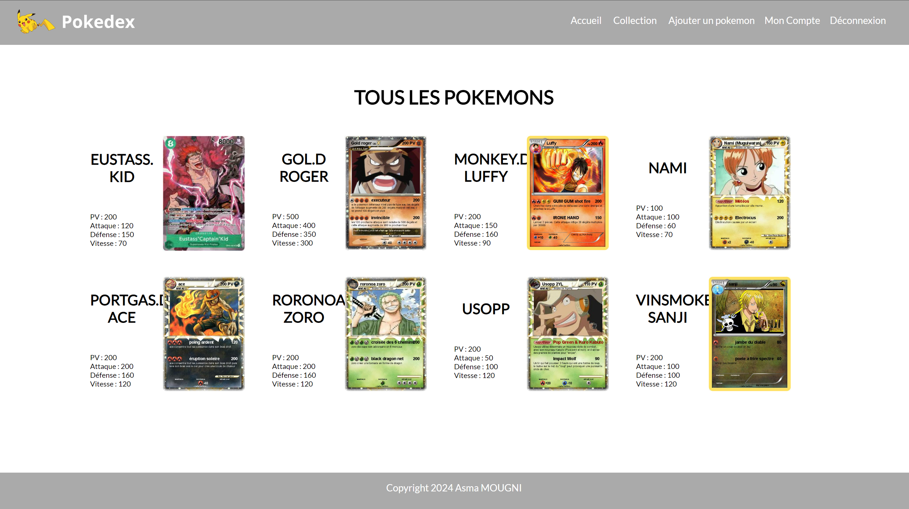

# Pokedex 
A website allowing the management of a Pokemon catalog by different registered users.

<h1>Features</h1>

    - User registration and login.  
    - Adding new Pokemons to the user's collection.  
    - Displaying the collection of Pokemons, sorted by name.  
    - Displaying the user's profile.  
    - Project Structure

<h1>The project is organized as follows:</h1>

- /includes : Directory containing PHP inclusion files.  
- index.php : Application home page.  
- connexion.php : User login and registration page.  
- collection.php : Page displaying the user's Pokemon collection.  
- add_pokemon.php : Page allowing to add a new Pokemon to the collection.  
- profile.php : Page displaying the user's profile.

<h1>Database</h1>
<h5>The project uses a MySQL database with two main tables:</h5>

- users : Stores information about users.   
- pokemons : Stores information about Pokemons, linked to a user.  

<h1>Installation</h1>

1] Clone this repository to your local machine.  
2] Import the database structure using the provided SQL file.  
3] Make sure you have a PHP and MySQL server installed on your machine.  
4] Configure the database connection settings in the db.php file.

<h1>Author</h1>

This project was developed by Asma MOUGNI as part of the Pokedex TP.

